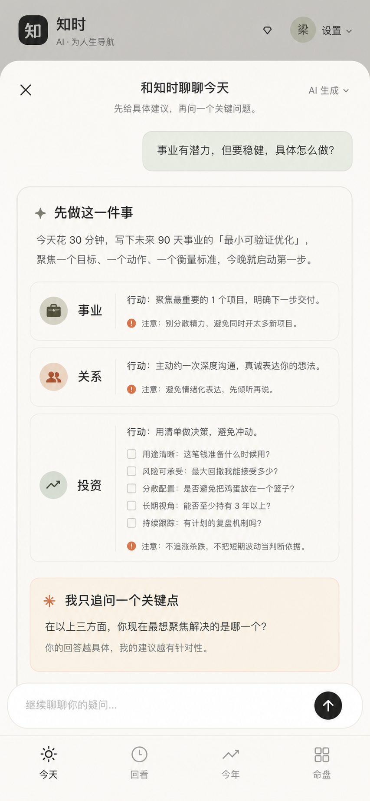

# 知时统一对话：审查与重设计规格

日期：2026-08-30

范围：原生 iOS / Android 移动端的“今天、今年、有点乱”主路径

## 结论

当前产品已经能给出内容，但价值被拆散在三条互相竞争的路径里：今天页的一次性解读、今年页的一次性解读、以及“有点乱”的三步现实梳理。用户必须先理解产品的信息架构，再决定去哪一块提问；而生成结果仍以解释和反思问题为主，没有稳定地输出“现在先做什么、具体怎么做、做到什么算完成”。

本次重设计把“有点乱”并入“今天”，保留旧记录的读取和编辑能力，但不再把它作为顶层入口。今天和今年共用同一个回答优先的对话系统：每一轮先给可执行初稿，再追问一个真正会改变建议的问题。

## 当前流程证据

1. ⚠️ 今天空状态：页面同时要求记录状态、建立命盘、理解“现实工具”和“文化解释”的边界，首屏没有一个明确的主动作。

   

2. ⚠️ 今年空状态：与今天重复解释“先建命盘”和“只显示确定性结果”，之后又进入另一套单次 AI 解读。

   

3. ❌ “有点乱”是底部导航里的动作，不是顶层目的地；它可以覆盖在“今年”页上，导致当前上下文不清楚。

   

4. ❌ AI 在第三步之后才开始提供价值，且第三步要求连续填写解释、担心、问题三个长文本框。

   

5. ❌ 在已经完成三步输入后还出现一次三选一确认，进一步推迟首次有效回答。

   

证据限制：当前浏览器环境没有用户真机内已保存的命盘，因此没有复现用户看到的具体命理解读文案；对“结果模糊”的判断同时依据当前响应结构、提示词与用户的真实反馈。截图均为本轮从当前代码运行态重新采集。

## 目标视觉稿

视觉稿用于锁定信息层级和交互密度；最终实现继续使用现有知时配色与卡片语言，并以原生组件、真实文本和可访问尺寸为准。

## 新信息架构

底部导航固定为 4 项：

| 入口 | 用途 | 不再承担的用途 |
| --- | --- | --- |
| 今天 | 今日周期、今日真实状态、今日对话 | 不再另开“有点乱”产品区 |
| 回看 | 每日状态和旧现实记录 | 不发起新的三步梳理 |
| 今年 | 已审计年度周期、年度对话 | 不再使用一次性解读卡 |
| 命盘 | 建立、核对和更新命盘 | 不承载日常建议 |

“我现在有点乱”改成今天对话里的快捷问题。旧的现实记录继续可读、可编辑、可删除，避免数据迁移或丢失。

## 对话行为

### 首次进入

- 今天页主卡标题：`别只告诉我“稳健”，告诉我下一步怎么做。`
- 主按钮：`和知时聊聊今天`
- 快捷问题：`今天先做什么`、`事业怎么落地`、`人际要注意什么`、`投资先检查什么`、`我现在有点乱`
- 今年页主按钮：`聊聊今年怎么落地`
- 没有命盘时，今天对话仍可基于用户主动填写的现实信息回答；明确标记为“只看现实”。今年页仍优先要求建立命盘。

### 每轮回答固定顺序

1. `先说结论`：条件化但明确，不使用“可能要稳健”作为结束语。
2. `先做这一件事`：动作、时间范围、完成标准三个字段齐全。
3. `具体例子`：2–3 个与问题相关的情景；每个包含“可以这样做”和“注意什么”。
4. `为什么这样说`：区分已审计命盘事实和用户主动提交的现实信息。
5. `我只追问一个关键点`：一次只问一个会显著改变下一步的问题。

首轮必须先给有用初稿，不能只返回澄清问题。用户回答后，下一轮必须引用最新回答并重写结论或行动，不得只追加泛泛说明。

### 高风险领域

- 投资：只提供决策清单、最大可承受损失、流动性、信息来源、退出与复盘条件；不推荐标的、不提示买卖时点、不鼓励借贷或杠杆。
- 医疗、法律、心理危机：停止普通文化解读，给出明确的专业支持路径。
- 事业与关系：优先给可逆、小范围、可核对的行动；不推断他人动机，不替用户做辞职、离婚等重大决定。

## 原生移动端规格

### 对话大页

- 展示：iOS 大号 sheet / Android bottom sheet，最大高度 94%，单层模态，不嵌套第二个确认框。
- 顶栏：56dp/pt 高；关闭按钮可见图标 24，点击区域至少 44×44；标题 17sp/pt Semibold；范围标签 13sp/pt。
- 内容边距：左右 20；卡片间距 12；分区间距 20。
- 用户气泡：最大宽度 88%，内边距 14，圆角 18，正文 16/23。
- AI 卡：圆角 20，1px 低对比描边，内边距 18；标题 20/27 Semibold；正文 16/24；辅助信息不小于 13/18。
- 示例行：每行独立卡片，内边距 14；领域标题 16 Semibold；动作和提醒 15/22。
- 追问卡：浅陶土背景，左侧语义图标，标题 17 Semibold，问题 16/24。
- 输入区：固定在键盘上方；输入框最小 52、高度最多 120；输入文字 16；发送按钮点击区域 48×48。
- 所有自定义按钮必须有按压态；发送中使用按钮内活动指示器和具体文案 `正在结合你的补充重写建议…`。

### 今天 / 今年主卡

- 卡片内边距 20，圆角 22。
- 标题 22/29 Semibold；正文 15/22。
- 快捷问题为横向可滚动 chip，高度至少 44，不嵌套同方向滚动。
- 主按钮高度 52；一个视图只保留一个高强调主动作。

### 导航与图标

- 使用 `expo-symbols`：iOS 映射 SF Symbols，Android/Web 映射 Material Symbols。
- 今天：`sun.max.fill` / `today`
- 回看：`clock.arrow.circlepath` / `history`
- 今年：`calendar` / `calendar_month`
- 命盘：`square.grid.2x2.fill` / `grid_view`
- 不再使用字符、emoji 或凸起的中心动作按钮。
- 每项点击区域至少 44×44，始终显示单词标签；选中状态同时使用填充/颜色和可访问 selected 状态。

## 隐私与状态

- 不再用额外确认卡打断首次回答；发送按钮上方持续显示简短说明，首次点击发送本身构成明确操作。
- 说明必须列出本轮实际会发送的内容：本轮文字、今天状态（如果存在）、最少量已审计命盘事实（如果存在）。
- API 不持久化对话；DeepSeek 按其条款处理请求；关闭对话前明确说明当前版本是否保留本轮内容。
- AI 不可用时，今天和今年仍展示确定性周期与本机现实状态，并给出可重试的内联错误。

## 实现验证

1. ✅ 移动端类型检查：`npm run typecheck` 通过。
2. ✅ Expo 原生依赖检查：`npx expo install --check` 通过；`expo-symbols` 与 SDK 57 兼容。
3. ✅ iOS 原生包导出：`npm run ios:export` 成功生成 Hermes bundle。
4. ✅ 服务端测试：128 项通过，覆盖只看现实、命盘与现实混合、最新回复强制引用、金融交易指令拒绝、安全信号停止、明确处理确认和对话顺序。
5. ⚠️ 更新后的本机实现截图未能在本轮重新采集：既有审查标签页在开发服务器重启后被桌面端浏览器的本地 URL 安全策略阻断。没有使用另一个浏览器或绕过该策略。本轮视觉证据因此包含改版前运行态截图、目标视觉稿、代码级尺寸检查和原生导出结果；最终真机视觉需以新 TestFlight 构建补测。
